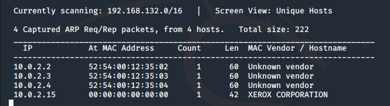
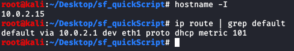
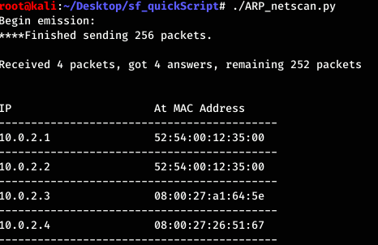
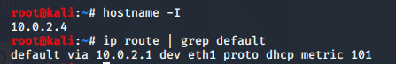
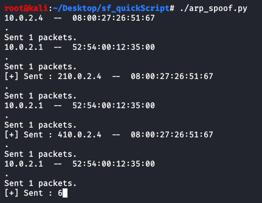
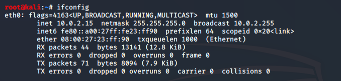
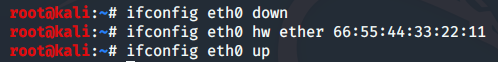
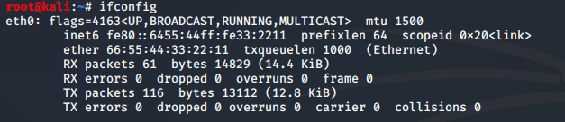

# Python Tutorials for Security Engineers

Three scripts to get you started with your adventure into the world of Cyber Security-- specfically ARP and its use for Man in the Middle attacks. Developed and tested on Kali Linux.

***

## So where do we start?

1. **Network Scanning** with Python

  - First we want to see what's out there on the network, using ARP_netscan.py to return a list of IP addresses on our subnet.

2. **ARP Spoofing** with Python

- arp_spoof.py is essentially a proof of concept for a man in the middle attack on confidentiality. We don't look at the contents of any packets here-- we have [another script](https://github.com/ggedgerton/MitMandMe) for that--  but with this file we do convince a target machine that **our** machine is the router it should be talking to. This script is also a great way to get blocklisted on ACLs, so...

3. **MAC Address Spoofing** with Python

- So we got caught ARP spoofing in steps one and two-- now we want to cover our tracks and try again. With this script, we can change our MAC address, pretend we're a whole new device, and get back at it.

- - -

## Netscanning With Python

*This simple network scanner functions much like 
Kali Linux's built-in netdiscover command.*

Our scanner uses ARP requests instead of pings to discover what hosts are running on the netwrok.

 

<B>Why is an ARP request preferrable in this instance?</B>

> ARP is an automated part of the day-to-day functioning of many network devices, so blue teamers are less likely to flag it in their logs and investigate us. ARP requests are also less likely to be blocked by firewall rules.

Here's what we'd expect to find using the built-in Kali tool **netdiscover**.

    Note that we are giving netdiscover our own subnet

    netdiscover outputs the subnet IP and MAC addresses of other devices on our network

We should get the same output by running [ARP_scanner.py](/ARP_netscan.py). Make sure to change the py_scan variable (at the end of the script) to the address of the subnet you want to scan!

 

<b>Why does the python script broadcast to "ff:ff:ff:ff:ff:ff"?</b>

> "ff:ff:ff:ff:ff:ff" is the broadcast MAC address, so this message will reach all computers on our network. Once we get a reply from a device, we replace "ff:ff:ff:ff:ff:ff" with the known MAC address, which gets used for the remainder of the script.

Now that we have a few devices to target, let's use an ARP attack to see what we can do.

***

## ARP Spoofing 

 
  
<b>What is an ARP spoofing attack and why would anyone do it?</b>

> In an ARP spoofing attack, often called a Man in the Middle attack, the attacker's device uses the ARP protocol to claim that it is a different machine on the network-- often disgusing itself as the router. Then other machines on the network send their traffic to the attacker's device instead of the real router, allowing the attacker to read any unencrypted information sent its way. This attack is used to steal confdential data.

Clients accept ARP responses even if they did not send a request-- and clients do not verify the ARP responses. Yikes. This means we can claim to be the owner of any IP address we want.

Below you will find the break down of an ARP attacker

1. Here is the IP address of my attack machine at 10.0.2.15. You can also see the address of the subnet's gateway router at 10.0.2.1. This is the router used by both my computer and the victim machine to access the internet.

2. When we run an ARP scan of the network from our attack client, we find a number of machines, including the one we want to attack: 10.0.2.4.

3. This is the IP Address of the machine I am targetting. 
<b>IMPORTANT: I own this target machine. Do not execute this attack against any machine that is not yours without explicit written permission.</b>

<i>Again, note that my attack and target clients share the same gateway router</i>

4. With this information, we can launch the attack and gain Man in the Middle access.

[This script](/arp_spoof.py) sends alternating packets to our gateway router and our target machine; these ARP packets match our MAC address to two different IP addresses. That is, we are telling the gateway router that our machine has the victim's IP address, and we are telling the victim that our machine has the gateway router's IP address. That way, traffic back and forth from the victim to the router flows through us.

***

## Mac Address Spoofing

Sometimes, we need to spoof our MAC address to bypass certain Access Control Lists that may have caught on to our bad behavior. We can do this at the command line, but why not put it into a script? Here's how.

### Command line method:

1. Check our MAC Address

    note my interface is eth0 and my MAC Address 08:00:27:23:ff:90

2. Linux Commands to change our MAC 

3. Confirm our MAC was changed

    
     My new MAC address is 66:55:44:33:22:11

How do we do this in Python? Why, there's a module for that!

>[This module](https://docs.python.org/3/library/subprocess.html) will let us use command line arguments in our python script

> We get the desired MAC address and network interface from the user during the execution of the script by using the input() function.

Check out the Mac Changer Script [here](/MACchanger.py).

 
  
Besides bypassing ACLs, why else might a hacker spoof their MAC address?
  

> To hide themselves on a network or impersonate another device.

