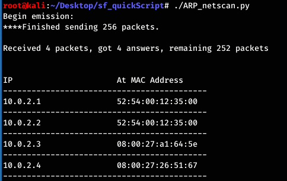

# Black Hat Beginner Python Tutorials

Three scripts to get you started with your adventure into the world of Cyber Security

***

### So where do we start

1. **Network Scanning** with Python

  - First we want to see what's out there on the network

2. **ARP Spoofing** with Python

- This is a man in the middle attack on confidentiality and a great way to get blacklisted on ACLs, so...

3. **MAC Address Spoofing** with Python

- So we got caught ARP spoofing and now we want to try again, let's change our MAC and get back at it

- - -

## Netscanning With Python

*This simple network scanner will function similar to Kali Linux's Net Discover*

 
  
For this scanner I am going to send out ARP requests instead of pinging. Why is an ARP request preferrable in this instance?

> We are assuming we are already on the network, so we don't need to ask devices if they're up or not with a ping, we can ask them who they are with an ARP request.

**netdiscover built in Kali tool**

    Note that we are giving netdiscover our own subnet

    netdiscover outputs the subnet IP and MAC addresses of other devices on our network

Check out this Python script for [Network Scanning](/ARP_netscan.py)

 
  
Why does the python script broadcast to "ff:ff:ff:ff:ff:ff"?

> When we don't know the MAC address we use the broadcast MAC destination as "ff:ff:ff:ff:ff:ff" as a place holder, so this message will reach all computers on our network. Once we get a reply from a device, we replace "ff:ff:ff:ff:ff:ff" with the known MAC address.

Now that we have a few devices to target it, let's use an ARP attack to see what we can do.

***

## ARP Spoofing 

 
  
What is an ARP spoofing attack and why would anyone do it?

> An attacker will target the subnet IP of a target so other devices will confuse the attacker and target, sending data to the attacker instead. It's a way to steal confdential data.

The reason this works is because clients accept responses even if they did not send a request, and clients do not verify the ARP responses.

Below you will find the break down of an ARP attacker

1. Here is IP address of our attack machine at 10.0.2.15 and our shared gateway router IP at 10.0.2.1

2. When we run an ARP scan from our attack client we find a number of machines, including the one we want to attack

3. I want to target my own client machine

    note that my attack and target clients share the same gateway router

4. Now we can launch the attack and gain MitM access

Note that in this example I am attacking another one of my own clients. This is not to be used on a machine that you do not own.

[ARP Spoofer Script](/arp_spoof.py)
***

## Mac Address Spoofing

 
  
Why do we want to spoof a MAC Address?

<<<<<<< Updated upstream
<<<<<<< Updated upstream
<<<<<<< Updated upstream
<<<<<<< Updated upstream
<<<<<<< Updated upstream
<<<<<<< Updated upstream
<<<<<<< Updated upstream

Spoofing a MAC Address allows us to  bypass certain access control lists 
=======
> Spoofing a MAC Address allows us to  bypass certain access control lists 
>>>>>>> Stashed changes
=======
> Spoofing a MAC Address allows us to  bypass certain access control lists 
>>>>>>> Stashed changes
=======
> Spoofing a MAC Address allows us to  bypass certain access control lists 
>>>>>>> Stashed changes
=======
> Spoofing a MAC Address allows us to  bypass certain access control lists 
>>>>>>> Stashed changes
=======
> Spoofing a MAC Address allows us to  bypass certain access control lists 
>>>>>>> Stashed changes
=======
> Spoofing a MAC Address allows us to  bypass certain access control lists 
>>>>>>> Stashed changes
=======
> Spoofing a MAC Address allows us to  bypass certain access control lists 
>>>>>>> Stashed changes

**How Can We Change Our MAC from the Linux CL?**

1. Check our MAC Address

    note my interface is eth0 and my MAC Address 08:00:27:23:ff:90

2. Linux Commands to change our MAC 

3. Confirm our MAC was changed

    
     My new MAC address is 66:55:44:33:22:11

 
  
So what tools/libraries/modules can we use in Python to automate this process?

>This [module](https://docs.python.org/3/library/subprocess.html) will let us use command line arguments in our python script
> How do we get user input?

[Mac Changer Script](/MACchanger.py)

 
  
Besides the obvious <i>allows us to bypass ACL</i>, why would a hack spoof a MAC address?
  

> To hide on a network or impersonate another device.
<<<<<<< Updated upstream
<<<<<<< Updated upstream
<<<<<<< Updated upstream
<<<<<<< Updated upstream
<<<<<<< Updated upstream
<<<<<<< Updated upstream

=======
=======
>>>>>>> Stashed changes
=======
>>>>>>> Stashed changes

## Netscanning With Python

*This simple network scanner will function similar to Kali Linux's Net Discover*

 
  
For this scanner I am going to send out ARP requests instead of pinging. Why is this preferrable in this instance?

> We are assuming we are already on the network, so we don't need to ask devices if they're up or not with a ping, we can ask them who they are with an ARP request.

<<<<<<< Updated upstream
<<<<<<< Updated upstream
=======
=======
>>>>>>> Stashed changes
=======
>>>>>>> Stashed changes

## Netscanning With Python

*This simple network scanner will function similar to Kali Linux's Net Discover*

 
  
For this scanner I am going to send out ARP requests instead of pinging. Why is this preferrable in this instance?

> We are assuming we are already on the network, so we don't need to ask devices if they're up or not with a ping, we can ask them who they are with an ARP request.

<<<<<<< Updated upstream
<<<<<<< Updated upstream
>>>>>>> Stashed changes
=======
>>>>>>> Stashed changes
=======
>>>>>>> Stashed changes
=======
>>>>>>> Stashed changes
=======
>>>>>>> Stashed changes

 
  
Why does the python script broadcast to "ff:ff:ff:ff:ff:ff"?

> When we don't know the MAC address we use the broadcast MAC destination as "ff:ff:ff:ff:ff:ff" as a place holder, so this message will reach all computers on our network. Once we get a reply from a device, we replace "ff:ff:ff:ff:ff:ff" with the known MAC address.

<<<<<<< Updated upstream
<<<<<<< Updated upstream
<<<<<<< Updated upstream
<<<<<<< Updated upstream
<<<<<<< Updated upstream
>>>>>>> Stashed changes
=======
>>>>>>> Stashed changes
=======
>>>>>>> Stashed changes
=======
>>>>>>> Stashed changes
=======
>>>>>>> Stashed changes
=======
>>>>>>> Stashed changes
